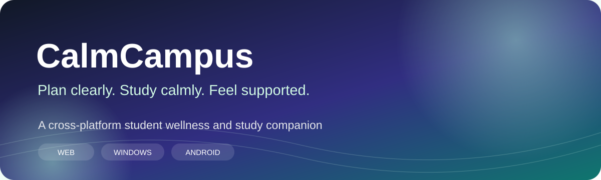
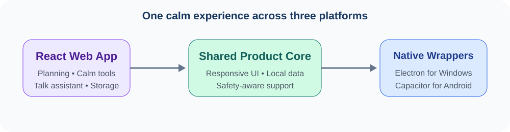

<p align="center">
  
</p>

<p align="center">
  <a href="https://calmcampus.onrender.com"><strong>Open the live app</strong></a>
  &nbsp;•&nbsp;
  <a href="#product-highlights">Highlights</a>
  &nbsp;•&nbsp;
  <a href="#run-locally">Run locally</a>
</p>

<p align="center">
  
  
  
  
  
</p>

## The idea

Students often use separate tools for timetables, saved study plans, calming exercises, background audio, and emotional support. **CalmCampus brings those needs into one focused workspace** designed to reduce setup friction and help students move from feeling overwhelmed to taking the next useful step.

This project demonstrates end-to-end product thinking: problem framing, responsive interface design, user-scoped local data, a safety-aware support experience, deployment, and packaging for web, Windows, and Android.

## Product highlights

| Experience | What it delivers |
| --- | --- |
| **Quick Planner** | Turns a small set of inputs into a focused study plan |
| **Detailed Planner** | Supports multiple subjects, longer sessions, and structured exam preparation |
| **Saved Plans** | Keeps plans available per user without requiring a database |
| **Talk Assistant** | Offers supportive, practical study guidance with clear safety boundaries |
| **Quick Calm Tools** | Provides breathing and grounding exercises for stressful study moments |
| **Ambience and Soft Mode** | Creates a gentler, less distracting study environment |
| **Cross-platform access** | Runs on the web and is packaged for Windows and Android |

<p align="center">
  
</p>

## Engineering decisions

- **Local-first persistence:** user plans and preferences stay in browser storage, keeping the prototype simple and fast.
- **Shared product core:** React and TypeScript power the main experience across all supported platforms.
- **Thin native wrappers:** Electron and Capacitor reuse the deployed web experience instead of maintaining separate applications.
- **Server-managed provider keys:** API credentials are handled through the deployment environment and are not stored in frontend code.
- **Responsive interaction design:** the interface adapts to desktop and mobile use while maintaining a calm visual language.

## Technology

`React` · `TypeScript` · `Vite` · `Tailwind CSS` · `TanStack Router` · `LocalStorage` · `Electron` · `Capacitor` · `Render`

## Run locally

Prerequisites: Node.js 22.12 or newer.

```bash
git clone https://github.com/praru-wq/calmmcampus.git
cd calmmcampus
npm install
npm run dev
```

Create a production build:

```bash
npm run build
```

## Platform packaging

- **Windows:** `npm run electron:dev` for local testing and `npm run electron:build` for an installer build.
- **Android:** use the Capacitor scripts in `package.json` to sync and open the Android project.
- Both native wrappers load the deployed application, so they require an internet connection.

## Responsible use

The Talk Assistant provides general emotional and study support. It is not a replacement for a doctor, therapist, counsellor, or emergency service.

## Project role

Designed and developed by **Prarthana** as a student product exploring how thoughtful software can support learning, focus, and wellbeing.

<p align="center"><sub>Built with curiosity, empathy, and a product-first mindset.</sub></p>
